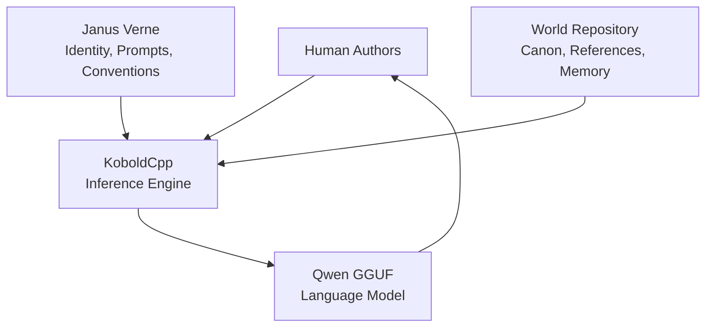

# Architecture

## Components

| Component        | Responsibility                                    |
| ---------------- | ------------------------------------------------- |
| KoboldCpp        | Executes the model and manages context            |
| Language Model   | Provides reasoning and prose                      |
| Janus Verne      | Provides identity, prompts, methodology and tests |
| World Repository | Provides canon and memory                         |
| Human Authors    | Provide purpose and judgment                      |
